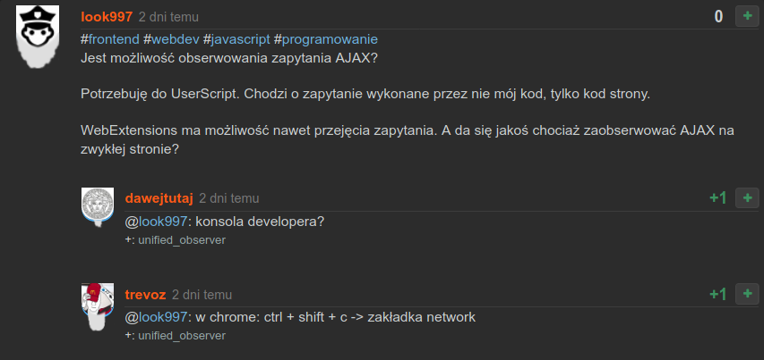

# WykopObserve - Biblioteka dla UserScript

Biblioteka dla UserScript przygotowana dla serwisu wykop.pl.

Wcześniej stworzyłem dodatek "Siwa Broda", dodający brodę długości i rodzaju odzwierciedlającego staż na wykopie autora wpisu czy komentarza.

Biblioteka powstała poprzez wyciągniecie z dodatku Siwa Broda modułu, którym można zrobić iterację po wszystkich elementach jak komentarze, wpisy, sub-komentarze i kilka innych elementów.
Co ważne, biblioteka obsługuje dynamiecznie doładującą się treść przy infinite scroll na tagach albo automatycznie uaktualniająca się lista komentarzy do wpisu.



## Jak użyć

Wystarczy utworzyć nowy skrypt w jednym z "Monkey Addons"([GreaseMonkey](https://addons.mozilla.org/firefox/addon/greasemonkey/), [TamperMonkey](https://addons.mozilla.org/firefox/addon/tampermonkey/), [ViolentMonkey](https://addons.mozilla.org/firefox/addon/violentmonkey/), [FireMonkey](https://addons.mozilla.org/firefox/addon/firemonkey/)), z taką treścią:

```javascript
// ==UserScript==
// @name        Wykop UserScript
// @description Wykop UserScript.
// @version     1.0
// @author      author
// @include     https://www.wykop.pl/*
// @require     wykopObserve.js
// @run-at      document-end
// ==/UserScript==

(async function () {
 
wykopObserve(filter, function (elements, attrs) {
 
}, options);

})()
```

Istotna jest linijka: `// @require     wykopObserve.js` - dzięki niej można użyć w UserSkrypcie funkcji `wykopObserve`.

Funkcja `wykopObserve` przyjmuje trzy parametry: tablicę `filter`, funkcję `callback` i obiekt `options` - jak na przykładzie.

Funkcja `callback` wykonuje się na ustalonych w parametrze `filter` typach elementów, jak wpis, komentarz itp.


## Parametry `wykopObserve`

* `filter:Array` (wymagany) - zawiera wybrane elementy z listy `places`
* `callback:function` (wymagany) - funkcja która ma się wykonać w każdym miejscu na stronie, który jest zawarty w `filter`.
* `options:Object` (niewymagany) - zawiera:
  * `once:boolean` (niewymagany) - czy wykonać callback tylko raz dla danego elementu.
  
`once` - To jest jedna jedyna dostępna opcja na ten moment.

Funkcję `wykopObserve` można używać wielokrotnie z różnymi filtrami, on potrafi rozróżnić odrębne wywołanie i rozpoznaje czy dla danego wywołania `wykopObserve` callback na danym elemencie został wykonany pierwszy czy kolejny raz.

## Funkcja refresh

Funkcja wykopObserve zwraca obiekt, zawierający funkcję refresh, którą można użyć żeby wykonać siłowo ponowne wykonanie `callback` na wszystkich wybranych rodzajach elementów, wbrew ustawieniu opcji `once`:

```javascript
const {refresh} = wykopObserve(filters, callback, options);
// (...)
refresh();
```

## Parametry funkcji callback

`callback` posiada atrybuty:

* `elements:Object` - zawiera:
  * `profileEl:HTMLElement` - element HTML o selektorze `.profile`
  * `liEl:HTMLElement` - element HTML o selektorze `li`, zawierający `.profile`
  * `contentEl:HTMLElement` - element HTML o selektorze `.profile`
* `attrs:Object` zawiera:
  * `place:string` - nazwa typu elementu, na którym wykonywany jest callback - zgodna z [`filters`](#Rodzaje-elementów-dozwolonych-w-tablicy-`filter`)
  * `isFirstTime:boolean` - ma wartość `true`, jeśli callback na tym konkretnym elemencie wykonuje się pierwszy raz, przy każdym kolejnym ma wartość false`
  * `nick:string` - nazwa użytkownika autora posta
  * `authorSex:["male","female",null]` - płeć autora posta
  
  
## Rodzaje elementów dozwolonych w tablicy `filter`

Tablica `filter` skadać się musi ze `stringów` takiego rodzaju:

### Komentarze, wpisy i subkomentarze. nazwane dla porządku `Comment` i `SubComment`

* "mikroblog-page-comment" - wpis na stronie wykop.pl/mikroblog
* "mikroblog-page-sub-comment" - komentarz do wpisu na stronie wykop.pl/mikroblog
* "link-page-comment" - komentarz na stronie wykop.pl/link (na stronie znaleziska)
* "link-page-sub-comment" - subkomentarz na stronie wykop.pl/link (na stronie znaleziska)
* "wpis-page-comment" - wpis na stronie wykop.pl/wpis (strona pojedynczego wpisu)
* "wpis-page-sub-comment" - komentarz do wpisu na stronie wykop.pl/wpis (strona pojedynczego wpisu)
* "tag-page-comment" - wpis na stronie wykop.pl/tag
* "tag-page-sub-comment" - komentarz do wpisu na stronie wykop.pl/tag
* "moj-page-comment" - wpis na stronie wykop.pl/moj
* "moj-page-sub-comment" - komentarz do wpisu na stronie wykop.pl/moj
* "glowna-page-comment" - wpis na głównej stronie wykop.pl
* "ludzie-page-link-sub-comment" - komentarz do znaleziska, widoczny na stronie wykop.pl/ludzie
* "ludzie-page-wpis-comment" - wpis, widoczny na stronie wykop.pl/ludzie
* "ludzie-page-wpis-sub-comment" - komentarz do wpisu, widoczny na stronie wykop.pl/ludzie

### Nietypowe elementy

* "header-profile-element" - element z awatarem zalogowanego użytkownika (mi było przydatne dodatku Siwa Broda)
* "link-page-author-element" - element nazwą i awatarem osoby, która dodała znalezisko (też przydatne dododatku Siwa Broda)
* "other" - każdy inny, nietypowy element HTML o selektorze `.profile`, na dowolnej podstronie, np. stronie wykop.pl/dodatki/pokaz (stronie konkretnego dodatku).

### Elementy przy polu wpisywania wpisu lub komentarza

Elementy przy polu wpisywania wpisu lub komentarza, z rozróżnieniem na poszczególne podstrony wykop.pl:

* "mikroblog-page-write-element"
* "link-page-write-element"
* "wpis-page-write-element"
* "tag-page-write-element"
* "ludzie-page-write-element"
* "moj-page-write-element"

## Obiekt filterGroups

Obiekt filterGroups jest zwracany przez `wykopObserve.js` i jest dostępny w UserScript z linijką `// @require     wykopObserve.js`.

Obiektu filterGroups można użyć w parametrze `filter` funkcji `wykopObserve`.

Posiada pola z tablicami:

* `all` - wszystkie możliwe filtry, nie licząc "other"
* `mikroblogLinkWpisGlownaTagMojComment` -  - każdy filtr Comment ze strony  mikroblog, link, wpis, glowna, tag, moj
* `mikroblogLinkWpisTagSubMojComment` - każdy filtr SubComment ze strony  mikroblog, link, wpis, tag, moj
* `mikroblogLinkWpisGlownaTagMojCommentOrSubComment` - każdy filtr Comment i SubComment ze strony  mikroblog, link, wpis, glowna, tag, moj
* `ludziePageCommentOrSubComment` - każdy filtr Comment i SubComment ze strony  ludzie
* `writeElement` - każdy filtr writeElement

Przykładowe użycie obiektu filterGroups:

```javascript
wykopObserve([
  filterGroups.mikroblogLinkWpisGlownaTagCommentOrSubComment
  filterGroups.writeElement
], callback, options);
```

Dzięki temu nie trzeba spisywać wszystkich filtrów z osobna.

Parametr `filter` się spłaszcza (jest potraktowane `arr.flat(Infinity)`), więc można użyć tablicy w tablicy, w tablicy...

Nieprawidłowe filtry są logowane w formie warning w konsoli przeglądarki jako np. `[WykopObserve] faulty filters: "glowna-page-commentx".` - warto sprawdzić log, żeby uniknąć literówek itp.

## Funkcja getAdjacentEls

Funkcja getAdjacentEls jest zwracana przez `wykopObserve.js` i jest dostępny w UserScript z linijką `// @require     wykopObserve.js`.

Prosta funkcja, zwraca elementy sąsiadujące z przekazanym w parametrze elementem - w zasadzie wszystkie dzieci rodzica.

```javascript
wykopObserve(filter, function (elements, attrs) {
  const adjacentEls = getAdjacentEls(elements.liEl);
  // (...)
}, options);
```

Np. dodatek "Poczytaj mi mamo" mógłby skorzystać z tej funkcji.

## String loginUser

String loginUser jest zwracany przez `wykopObserve.js` i jest dostępny w UserScript z linijką `// @require     wykopObserve.js`.

Zmienna posiadająca nazwę zalogowanego użytkownika.

```javascript
wykopObserve(filter, function (elements, attrs) {
  if (loginUser === attrs.nick) {
    // (...)
  };
}, options);
```

## UserScript-y wykorzystujące bibliotekę wykopObserve

* [Siwa Broda](https://www.wykop.pl/dodatki/pokaz/789/) - Siwa broda pod awatarem. Tym dłuższa, im dłuższy staż na wykopie. Dodatek autorstwa look997 (mój).
* Notatkowator 2020 - Szybki podgląd notek. Moja reedycja dodatku Notatkowator 2000, oryginalnie autorstwa piokom123. Działa lepiej niż oryginał.

Spokojnie można przepisać np. dodatek "Poczytaj mi mamo", jak i wiele innych, z użyciem biblioteki WykopObserve.
Także mam nadzieję, że bibliteka ułatwi realizację nowych pomysłów. Wykopowicz z pomysłem, po prostu będzie miał z główy problem wykrywania wpisów, komentarzy itd., może od razu przejść do rzeczy.

## Kandydaci

Przejrzałem dodatki na stronie [wykop.pl/dodatki](https://www.wykop.pl/dodatki/). Są tam dodatki, które mogą być przepisane pod bibliotekę WykopObserve:

* [ZielonkaBloker](https://www.wykop.pl/dodatki/pokaz/967/)
* [Czyściciel Mirko](https://www.wykop.pl/dodatki/pokaz/965/)
* [Wykopowy Przypominacz](https://www.wykop.pl/dodatki/pokaz/963/)
* [BronskyTrolluje!](https://www.wykop.pl/dodatki/pokaz/1091/)
* [Czarna lista plusujących](https://www.wykop.pl/dodatki/pokaz/1079/)
* [MikroMirror](https://www.wykop.pl/dodatki/pokaz/1021/)
* [WykopGif](https://www.wykop.pl/dodatki/pokaz/1019/)
* [Mirko Filter](https://www.wykop.pl/dodatki/pokaz/1013/)
* [Zgłaszanie za brak #polityka jednym kliknięciem](https://www.wykop.pl/dodatki/pokaz/969/)
* [Wykop videos - youtube videos z glownej wyswietlone w jednym miejscu](https://www.wykop.pl/dodatki/pokaz/1143/)
* [Hidder](https://www.wykop.pl/dodatki/pokaz/1105/)
* [Wykop Embed Helper](https://www.wykop.pl/dodatki/pokaz/1107/)
* [Skocz do czasu na youtube](https://www.wykop.pl/dodatki/pokaz/1069/)
* [Dość nocnej](https://www.wykop.pl/dodatki/pokaz/883/)
* [Gruszkozgłaszacz](https://www.wykop.pl/dodatki/pokaz/815/)
* [CancerRemover](https://www.wykop.pl/dodatki/pokaz/937/)
* [Nocna Zmiana? Nie słyszałem o niej.](https://www.wykop.pl/dodatki/pokaz/933/)
* [Chciałbym być marynarzem, chciałbym pamiętać komentarze - cytatonaprawiacz](https://www.wykop.pl/dodatki/pokaz/931/)
* [WykopBingo!](https://www.wykop.pl/dodatki/pokaz/927/)
* [Poczytaj mi, mamo](https://www.wykop.pl/dodatki/pokaz/915/)
* [Krawężnik](https://www.wykop.pl/dodatki/pokaz/917/)
* [ObrazekZeSchowka](https://www.wykop.pl/dodatki/pokaz/911/)
* [codeFormatter](https://www.wykop.pl/dodatki/pokaz/889/)
* [AnkietoRozbudowywacz](https://www.wykop.pl/dodatki/pokaz/887/)
* [Taguj to gówno](https://www.wykop.pl/dodatki/pokaz/885/)
* [Mirkoukrywacz](https://www.wykop.pl/dodatki/pokaz/867/)
* [Zawołaj osoby, które chciały być zawołane](https://www.wykop.pl/dodatki/pokaz/745/)
* [Zawołaj plusujących](https://www.wykop.pl/dodatki/pokaz/743/)
* [Dobre  strony wykopu](https://www.wykop.pl/dodatki/pokaz/727/)
* [@92GRUSZKA ALL CAPS](https://www.wykop.pl/dodatki/pokaz/725/)
* [Skocz do czasu na youtube](https://www.wykop.pl/dodatki/pokaz/1069/)
* [CebulaDealsTrollRemoval](https://www.wykop.pl/dodatki/pokaz/721/)
* [Mirkoblocker](https://www.wykop.pl/dodatki/pokaz/694/)
* [Mirrorek+](https://www.wykop.pl/dodatki/pokaz/690/)
* [Pokazywanie obrazków po kliknięciu na link w komentarzu](https://www.wykop.pl/dodatki/pokaz/63/)
* [Naprawiacz pasków](https://www.wykop.pl/dodatki/pokaz/285/)
* [Pokazywarka wykopo i zakopowiczów +](https://www.wykop.pl/dodatki/pokaz/231/)
* [Ukrywacz zer](https://www.wykop.pl/dodatki/pokaz/223/)
* [Obiektywny wykop](https://www.wykop.pl/dodatki/pokaz/87/)
* [Ukrywanie wątków w komentarzach](https://www.wykop.pl/dodatki/pokaz/510/)
* [Wykop - obserwowanie](https://www.wykop.pl/dodatki/pokaz/454/)
* [Wykop CanComment](https://www.wykop.pl/dodatki/pokaz/436/)
* [SFW v1.1.0](https://www.wykop.pl/dodatki/pokaz/434/)
* [Tagowyłapywacz](https://www.wykop.pl/dodatki/pokaz/430/)
* [Usuwanie komentarzy z żartem 'usuń konto'](https://www.wykop.pl/dodatki/pokaz/407/)
* [Głosuj wszystkie komentarze!](https://www.wykop.pl/dodatki/pokaz/380/)
* [Pokaż wszystkie spoilery w mikroblogu](https://www.wykop.pl/dodatki/pokaz/375/)
* [Sprawdzacz czarnolisto](https://www.wykop.pl/dodatki/pokaz/323/)
* [Ukryj wpisy na mirko](https://www.wykop.pl/dodatki/pokaz/662/)
* [Mirko zwin](https://www.wykop.pl/dodatki/pokaz/660/)
* [Pokaż długość filmu YT na wykop.pl (2015.08)](https://www.wykop.pl/dodatki/pokaz/614/)
* [Przewijanie obserwowanego znaleziska do nieprzeczytanych komentarzy](https://www.wykop.pl/dodatki/pokaz/594/)
* [Wykop Rozwijacz](https://www.wykop.pl/dodatki/pokaz/600/)
